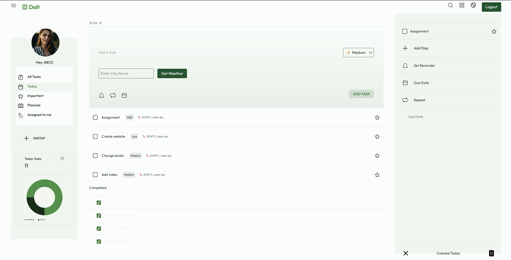
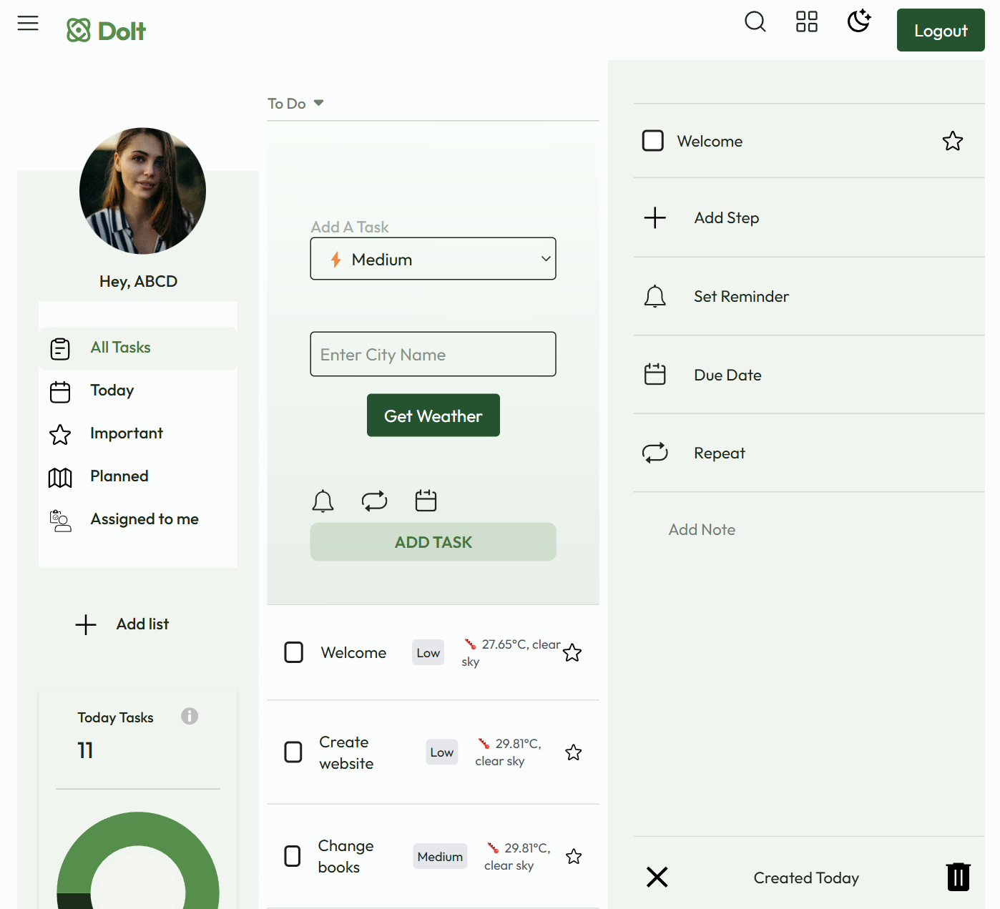
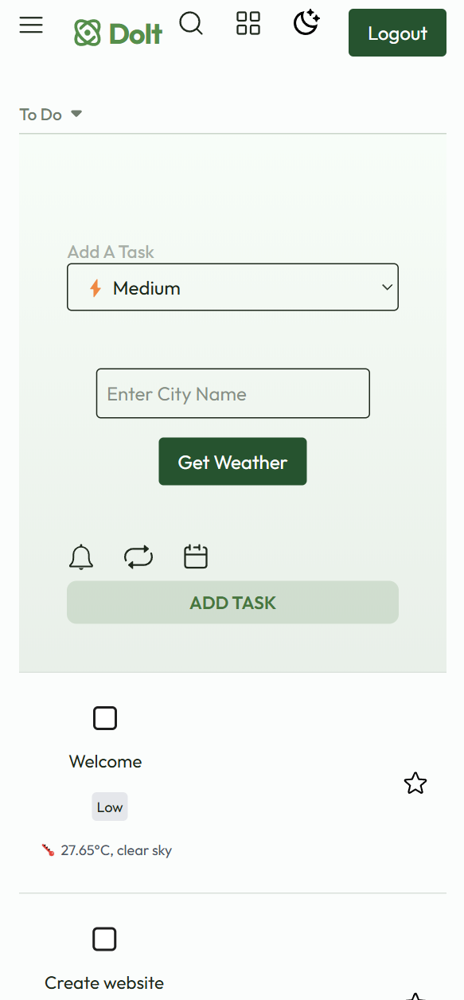

📋 To-Do App
A simple and efficient To-Do App built with the MERN stack, allowing users to manage tasks effectively. Users can create, update, delete, and mark tasks as complete.

🚀 Features
✅ User Authentication – Login authentication
📝 Add Tasks – Easily create new tasks
✏️ Edit Tasks – Modify existing tasks
✅ Mark as Complete – Strike through completed tasks
🗑️ Delete Tasks – Remove unwanted tasks
🎨 Responsive UI – Works seamlessly on all devices

🛠️ Tech Stack
Frontend: React.js, Tailwind CSS
State Management: React Hooks

🏗️ Installation & Setup
1️⃣ Clone the Repository
git clone https://github.com/shelavalepallavi/todo-app
cd todo-app

3️⃣ Frontend Setup
cd todo-app
npm install

Start the frontend server:
npm run dev

📸 Screenshots

### Desktop

### Tablet

### Mobile

💡 Future Enhancements
🌙 Dark Mode
📆 Due Date Reminders
📂 Categories for Tasks

🔗 https://github.com/shelavalepallavi/todo-app
